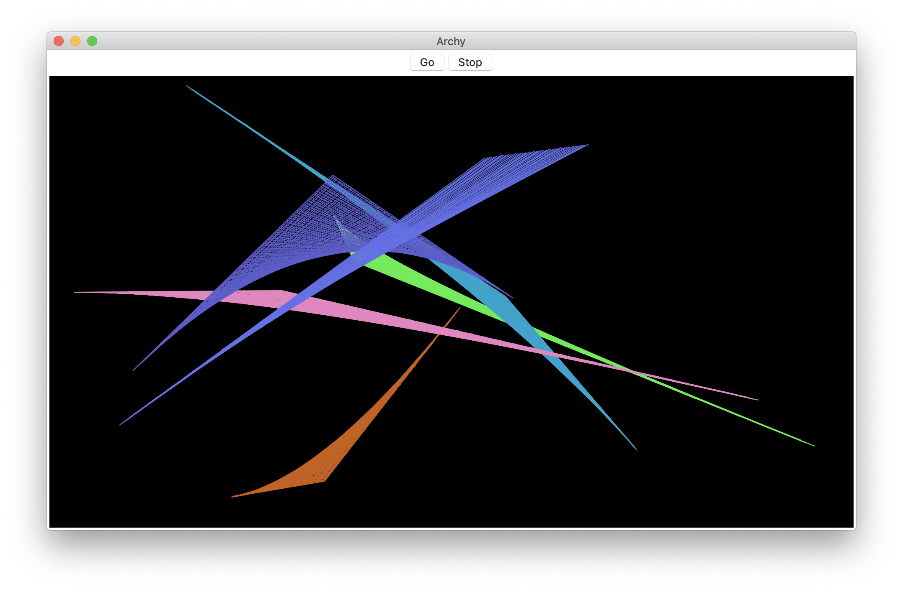

# Archy
A very simple python tkinter toy program similar to vintage screensavers from the 90's.

 

Click "Go" or "Stop" to control animation.  
Click and drag to erase.

**Required Software Packages**

* python 3
* tkinter  (included in python 3)
* random   (included in python 3)
* time     (included in python 3)

